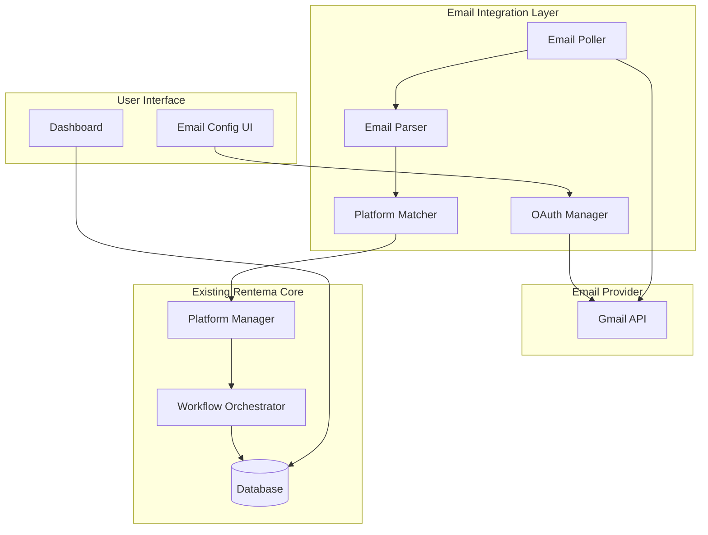

# Email Integration Design Document

## Overview

The Email Integration feature extends Rentema's inquiry capture capabilities by monitoring a property manager's email account for rental inquiry notifications from listing platforms. This enables Rentema to automatically process inquiries from platforms that don't provide direct API access or webhooks (such as Facebook Marketplace and Craigslist), as well as provide a backup channel for platforms with API integrations.

The system uses OAuth 2.0 to securely access the user's Gmail account, periodically polls for new inquiry emails, identifies the source platform using pattern matching, extracts structured data from email content, and creates inquiries that feed into Rentema's existing automated workflow.

This design integrates seamlessly with the existing Platform Manager architecture, treating email as another inquiry source alongside direct platform integrations.

## Architecture

### High-Level Architecture



### Technology Stack

- **Gmail API**: Google's official API for email access with OAuth 2.0
- **OAuth 2.0**: Secure authorization using Google's OAuth flow
- **Email Parsing**: Custom parsers for each platform's email format
- **Pattern Matching**: Regular expressions and heuristics for platform identification
- **Encryption**: AES-256 for storing OAuth tokens
- **Scheduling**: Node-cron or Bull queue for periodic polling
- **Testing**: Jest for unit tests, fast-check for property-based testing

## Components and Interfaces

### 1. OAuth Manager

Handles Google OAuth 2.0 flow for Gmail access.

**Responsibilities:**
- Initiate OAuth authorization flow
- Exchange authorization code for access/refresh tokens
- Store tokens securely with encryption
- Refresh expired access tokens automatically
- Revoke tokens on disconnection

**Interface:**
```typescript
interface OAuthManager {
  getAuthorizationUrl(): string;
  exchangeCodeForTokens(code: string, managerId: string): Promise<EmailConnection>;
  refreshAccessToken(connectionId: string): Promise<void>;
  revokeAccess(connectionId: string): Promise<void>;
  verifyConnection(connectionId: string): Promise<EmailVerification>;
}

interface EmailConnection {
  id: string;
  managerId: string;
  emailAddress: string;
  accessToken: string; // encrypted
  refreshToken: string; // encrypted
  tokenExpiry: Date;
  isActive: boolean;
  createdAt: Date;
  updatedAt: Date;
}

interface EmailVerification {
  isValid: boolean;
  emailAddress?: string;
  error?: string;
}
```

### 2. Email Poller

Periodically checks email account for new inquiry messages.

**Responsibilities:**
- Poll Gmail API on configured interval (default: 5 minutes)
- Retrieve only unread messages from last 7 days
- Apply configured filters (sender, subject keywords)
- Mark processed emails as read
- Handle polling errors and token refresh
- Track last poll time and statistics

**Interface:**
```typescript
interface EmailPoller {
  startPolling(connectionId: string): void;
  stopPolling(connectionId: string): void;
  pollNow(connectionId: string): Promise<PollResult>;
  getPollingStatus(connectionId: string): PollingStatus;
}

interface PollResult {
  emailsFound: number;
  emailsProcessed: number;
  emailsSkipped: number;
  errors: string[];
  timestamp: Date;
}

interface PollingStatus {
  isActive: boolean;
  lastPollTime?: Date;
  nextPollTime?: Date;
  consecutiveFailures: number;
}
```

### 3. Platform Matcher

Identifies which listing platform sent an email.

**Responsibilities:**
- Match email sender and subject against platform patterns
- Support configurable platform patterns
- Provide confidence scores for matches
- Handle ambiguous or unknown senders

**Interface:**
```typescript
interface PlatformMatcher {
  identifyPlatform(email: RawEmail): PlatformMatch;
  addPlatformPattern(pattern: PlatformPattern): Promise<void>;
  getPlatformPatterns(): Promise<PlatformPattern[]>;
}

interface RawEmail {
  id: string;
  from: string;
  subject: string;
  body: string;
  receivedDate: Date;
}

interface PlatformMatch {
  platformType: 'facebook' | 'zillow' | 'craigslist' | 'turbotenant' | 'unknown';
  confidence: number; // 0-1
  matchedPattern?: string;
}

interface PlatformPattern {
  id: string;
  platformType: string;
  senderPattern: string; // regex
  subjectPattern?: string; // regex
  priority: number;
  isActive: boolean;
}
```

### 4. Email Parser

Extracts structured inquiry data from email content.

**Responsibilities:**
- Parse email body based on platform type
- Extract tenant name, message, property reference
- Extract contact information when available
- Handle various email formats (HTML, plain text)
- Provide fallback for unparseable fields

**Interface:**
```typescript
interface EmailParser {
  parseEmail(email: RawEmail, platformType: string): Promise<ParsedInquiry>;
  testParse(email: RawEmail): Promise<ParseResult>;
}

interface ParsedInquiry {
  tenantName?: string;
  tenantEmail?: string;
  tenantPhone?: string;
  message: string;
  propertyReference?: string;
  propertyAddress?: string;
  platformType: string;
  originalEmailId: string;
  receivedDate: Date;
  parsingErrors: string[];
}

interface ParseResult {
  success: boolean;
  extractedFields: Record<string, any>;
  missingFields: string[];
  errors: string[];
}
```

### 5. Property Matcher

Matches extracted property references to existing properties.

**Responsibilities:**
- Match property address or reference to database
- Use fuzzy matching for address variations
- Handle unmatched properties
- Provide match confidence scores

**Interface:**
```typescript
interface PropertyMatcher {
  matchProperty(propertyReference: string, managerId: string): Promise<PropertyMatch>;
  matchByAddress(address: string, managerId: string): Promise<PropertyMatch>;
}

interface PropertyMatch {
  matched: boolean;
  propertyId?: string;
  confidence: number;
  matchedAddress?: string;
}
```

### 6. Email Inquiry Service

Orchestrates the email-to-inquiry conversion process.

**Responsibilities:**
- Coordinate polling, parsing, and inquiry creation
- Prevent duplicate inquiry creation
- Track processing statistics
- Handle errors gracefully
- Integrate with existing Platform Manager

**Interface:**
```typescript
interface EmailInquiryService {
  processNewEmails(connectionId: string): Promise<ProcessingResult>;
  createInquiryFromEmail(parsedInquiry: ParsedInquiry, managerId: string): Promise<string>;
  getProcessingStats(connectionId: string, dateRange?: DateRange): Promise<EmailStats>;
}

interface ProcessingResult {
  emailsProcessed: number;
  inquiriesCreated: number;
  inquiriesUnmatched: number;
  errors: ProcessingError[];
}

interface ProcessingError {
  emailId: string;
  error: string;
  timestamp: Date;
}

interface EmailStats {
  totalEmailsProcessed: number;
  successfulExtractions: number;
  failedParsing: number;
  platformBreakdown: Record<string, number>;
  lastSyncTime?: Date;
}
```

### 7. Email Filter Configuration

Manages user-defined filters for email processing.

**Responsibilities:**
- Store and retrieve filter rules
- Apply filters during email polling
- Provide default filters for common platforms
- Validate filter syntax

**Interface:**
```typescript
interface EmailFilterService {
  saveFilters(connectionId: string, filters: EmailFilters): Promise<void>;
  getFilters(connectionId: string): Promise<EmailFilters>;
  applyFilters(email: RawEmail, filters: EmailFilters): boolean;
  getDefaultFilters(): EmailFilters;
}

interface EmailFilters {
  senderWhitelist: string[]; // email addresses or domains
  subjectKeywords: string[];
  excludeSenders: string[];
  excludeSubjectKeywords: string[];
}
```

## Data Models

### Email Connection

```typescript
interface EmailConnection {
  id: string;
  managerId: string;
  emailAddress: string;
  accessToken: string; // encrypted
  refreshToken: string; // encrypted
  tokenExpiry: Date;
  isActive: boolean;
  lastPollTime?: Date;
  createdAt: Date;
  updatedAt: Date;
}
```

### Processed Email

```typescript
interface ProcessedEmail {
  id: string;
  connectionId: string;
  emailId: string; // Gmail message ID
  from: string;
  subject: string;
  receivedDate: Date;
  platformType: string;
  inquiryId?: string;
  processingStatus: 'success' | 'failed' | 'skipped';
  parsingErrors?: string[];
  processedAt: Date;
}
```

### Platform Pattern

```typescript
interface PlatformPattern {
  id: string;
  platformType: string;
  senderPattern: string;
  subjectPattern?: string;
  bodyPatterns?: Record<string, string>; // field name -> regex
  priority: number;
  isActive: boolean;
  createdAt: Date;
  updatedAt: Date;
}
```

### Email Filters

```typescript
interface EmailFilterConfig {
  id: string;
  connectionId: string;
  senderWhitelist: string[];
  subjectKeywords: string[];
  excludeSenders: string[];
  excludeSubjectKeywords: string[];
  createdAt: Date;
  updatedAt: Date;
}
```

### Inquiry Extension

Extend existing Inquiry model to track email source:

```typescript
interface Inquiry {
  // ... existing fields
  sourceType: 'platform_api' | 'email' | 'manual';
  sourceEmailId?: string;
  sourceMetadata?: Record<string, any>;
}
```

## Correctness Properties

*A property is a characteristic or behavior that should hold true across all valid executions of a system-essentially, a formal statement about what the system should do. Properties serve as the bridge between human-readable specifications and machine-verifiable correctness guarantees.*


### Property 1: OAuth token storage round-trip
*For any* valid OAuth access and refresh tokens, storing them encrypted and then retrieving them should return equivalent token data
**Validates: Requirements 1.2**

### Property 2: Email connection verification
*For any* stored OAuth tokens, verifying the connection should successfully retrieve the user's email address from Gmail API
**Validates: Requirements 1.3**

### Property 3: Connection status display
*For any* established email connection, retrieving the connection should return the active status and associated email address
**Validates: Requirements 1.4**

### Property 4: Credential cleanup on disconnect
*For any* active email connection, disconnecting should remove all stored credentials and mark the connection as inactive
**Validates: Requirements 1.5**

### Property 5: Poll message filtering
*For any* polling operation, all retrieved messages should be unread and have received dates within the last 7 days
**Validates: Requirements 2.2**

### Property 6: Duplicate prevention through marking
*For any* processed email, marking it as read should prevent it from being retrieved in subsequent polls
**Validates: Requirements 2.3**

### Property 7: Token refresh on expiration
*For any* polling operation that encounters an expired token error, the system should attempt to refresh the access token
**Validates: Requirements 2.4**

### Property 8: Notification on refresh failure
*For any* token refresh failure, the system should create a notification for the property manager
**Validates: Requirements 2.5**

### Property 9: Unknown email skipping
*For any* email that doesn't match any platform patterns, the system should skip processing and not create an inquiry
**Validates: Requirements 3.5**

### Property 10: Tenant name extraction
*For any* inquiry email containing a tenant name, parsing should extract and include the name in the parsed result
**Validates: Requirements 4.1**

### Property 11: Message content extraction
*For any* inquiry email, parsing should extract the message content
**Validates: Requirements 4.2**

### Property 12: Property reference extraction
*For any* inquiry email containing property information, parsing should extract the property address or listing reference
**Validates: Requirements 4.3**

### Property 13: Contact information extraction
*For any* inquiry email containing contact information, parsing should extract the tenant's email or phone number
**Validates: Requirements 4.4**

### Property 14: Graceful partial parsing
*For any* inquiry email where required fields cannot be extracted, the system should create an inquiry with available data and flag it for review
**Validates: Requirements 4.5**

### Property 15: Property matching attempt
*For any* extracted inquiry with property information, the system should attempt to match it against existing properties
**Validates: Requirements 5.1**

### Property 16: Matched inquiry linking
*For any* successful property match, the created inquiry should be linked to the matched property ID
**Validates: Requirements 5.2**

### Property 17: Unmatched inquiry creation
*For any* inquiry that doesn't match an existing property, the system should create an unmatched inquiry flagged for manual assignment
**Validates: Requirements 5.3**

### Property 18: Workflow trigger on creation
*For any* inquiry created from email, the pre-qualification workflow should be triggered
**Validates: Requirements 5.4**

### Property 19: Email ID storage for deduplication
*For any* created inquiry from email, the original email ID should be stored, and processing the same email ID again should not create a duplicate inquiry
**Validates: Requirements 5.5**

### Property 20: Filter application
*For any* email that doesn't match configured sender or subject filters, the system should skip processing that email
**Validates: Requirements 6.3**

### Property 21: Filter update propagation
*For any* filter configuration update, subsequent polling operations should apply the new filters
**Validates: Requirements 6.4**

### Property 22: Email source indication
*For any* inquiry created from email, retrieving the inquiry should indicate email as the source type
**Validates: Requirements 7.1**

### Property 23: Platform source display
*For any* inquiry created from email, retrieving the inquiry should include the platform that sent the email
**Validates: Requirements 7.2**

### Property 24: Email received date tracking
*For any* inquiry created from email, retrieving the inquiry should include the date and time the email was received
**Validates: Requirements 7.3**

### Property 25: Source type filtering
*For any* set of inquiries with mixed sources, filtering by source type 'email' should return only inquiries that originated from email
**Validates: Requirements 7.4**

### Property 26: Original email preservation
*For any* inquiry with parsing errors, the original email content should be stored and retrievable for manual review
**Validates: Requirements 7.5**

### Property 27: Test mode non-persistence
*For any* sample email parsed in test mode, the system should extract and display data without creating an inquiry in the database
**Validates: Requirements 8.2**

### Property 28: Test mode field display
*For any* test mode parsing operation, the results should show which fields were successfully extracted
**Validates: Requirements 8.3**

### Property 29: Test mode error display
*For any* test mode parsing operation with errors, the results should display all parsing errors and warnings
**Validates: Requirements 8.4**

### Property 30: Manual sync execution
*For any* manual sync trigger, the system should immediately poll for new emails without waiting for the scheduled interval
**Validates: Requirements 9.2**

### Property 31: Sync status feedback
*For any* manual sync operation in progress, the system should provide real-time status updates
**Validates: Requirements 9.3**

### Property 32: Sync completion results
*For any* completed manual sync, the system should display the number of new inquiries found and created
**Validates: Requirements 9.4**

### Property 33: Sync error messaging
*For any* failed manual sync, the system should display specific error messages indicating the failure reason
**Validates: Requirements 9.5**

### Property 34: Statistics accuracy - total processed
*For any* email connection, the dashboard statistics for total emails processed should equal the count of all processed emails for that connection
**Validates: Requirements 10.1**

### Property 35: Statistics accuracy - successful extractions
*For any* email connection, the dashboard statistics for successful extractions should equal the count of emails that resulted in created inquiries
**Validates: Requirements 10.2**

### Property 36: Statistics accuracy - failed parsing
*For any* email connection, the dashboard statistics for failed parsing should equal the count of emails with processing status 'failed'
**Validates: Requirements 10.3**

### Property 37: Last sync tracking
*For any* email connection, the dashboard should display the timestamp and status of the most recent polling operation
**Validates: Requirements 10.4**

### Property 38: Platform breakdown accuracy
*For any* email connection, the dashboard platform breakdown should correctly group processed emails by identified platform type
**Validates: Requirements 10.5**

## Error Handling

### OAuth and Authentication Errors

- **Authorization Denied**: When user denies OAuth permission, display clear message and allow retry
- **Token Expiration**: Automatically attempt token refresh; notify user only if refresh fails
- **Invalid Credentials**: Mark connection as inactive and prompt user to reconnect
- **API Quota Exceeded**: Implement exponential backoff and notify user of temporary service interruption
- **Network Failures**: Retry with exponential backoff up to 3 attempts; log failures for monitoring

### Email Polling Errors

- **Connection Timeout**: Retry with exponential backoff; skip current poll cycle if timeout persists
- **Rate Limiting**: Respect Gmail API rate limits; adjust polling frequency dynamically if needed
- **Malformed Email Data**: Log error details; skip problematic email and continue processing others
- **Partial Email Retrieval**: Process successfully retrieved emails; retry failed retrievals on next poll

### Parsing Errors

- **Unrecognized Format**: Create inquiry with raw email content; flag for manual review
- **Missing Required Fields**: Create partial inquiry with available data; flag for completion
- **Invalid Data Types**: Use fallback values; log validation errors for pattern improvement
- **HTML Parsing Failures**: Fall back to plain text extraction; preserve original for manual review

### Property Matching Errors

- **Multiple Matches**: Use highest confidence match; flag inquiry for verification
- **No Matches**: Create unmatched inquiry; provide property selection UI for manual assignment
- **Ambiguous Address**: Store all potential matches; prompt user to select correct property

### Integration Errors

- **Workflow Trigger Failure**: Log error; retry workflow initiation; alert if retry fails
- **Database Errors**: Use transactions to maintain consistency; rollback on failure
- **Duplicate Detection Failure**: Check email ID before creating inquiry; skip if already processed

## Testing Strategy

### Unit Testing

Rentema will use Jest as the primary unit testing framework. Unit tests will focus on:

- **OAuth flow components**: Test token exchange, refresh, and revocation logic
- **Email parsing logic**: Test extraction of fields from various email formats
- **Platform matching**: Test pattern matching against different sender/subject combinations
- **Property matching**: Test address matching with various formats and fuzzy matching
- **Filter application**: Test email filtering with different filter configurations
- **Error handling**: Test graceful degradation for various error scenarios
- **Statistics calculation**: Test accuracy of dashboard metrics

Unit tests should mock external dependencies (Gmail API, database) to test logic in isolation.

### Property-Based Testing

Rentema will use **fast-check** as the property-based testing library for TypeScript/Node.js. Property-based tests will verify universal properties across randomly generated inputs.

**Configuration**: Each property-based test should run a minimum of 100 iterations to ensure thorough coverage of the input space.

**Tagging**: Each property-based test MUST include a comment tag explicitly referencing the correctness property from this design document using the format: `**Feature: email-integration, Property {number}: {property_text}**`

**Property Test Coverage**:
- Round-trip properties for token storage (Property 1)
- Connection verification and cleanup (Properties 2, 3, 4)
- Email filtering and deduplication (Properties 5, 6, 19, 20, 21)
- Parsing and extraction (Properties 10, 11, 12, 13, 14)
- Property matching and inquiry creation (Properties 15, 16, 17, 18)
- Source tracking and display (Properties 22, 23, 24, 25, 26)
- Test mode behavior (Properties 27, 28, 29)
- Manual sync operations (Properties 30, 31, 32, 33)
- Statistics accuracy (Properties 34, 35, 36, 37, 38)

Property-based tests should generate realistic random data:
- Valid OAuth tokens with various expiration times
- Email messages with different formats (HTML, plain text, mixed)
- Various sender addresses and subject lines
- Property addresses with different formats
- Filter configurations with various patterns

### Integration Testing

Integration tests will verify:
- End-to-end OAuth flow with Google (using test accounts)
- Email polling and processing pipeline
- Integration with existing Platform Manager and Workflow Orchestrator
- Database operations for storing connections, emails, and inquiries
- Error recovery and retry mechanisms

### Test Mode

The system includes a test mode (Requirement 8) that allows testing email parsing without connecting to Gmail:
- Upload sample emails in various formats
- Test parsing logic without creating inquiries
- Validate extraction patterns for different platforms
- Provide immediate feedback on parsing success/failure

## Implementation Notes

### Security Considerations

- **Token Encryption**: OAuth tokens must be encrypted at rest using AES-256 with unique keys per connection
- **Secure Token Storage**: Store encryption keys separately from encrypted data (use environment variables or key management service)
- **Token Scope Limitation**: Request minimal Gmail API scopes (readonly for email access)
- **HTTPS Only**: All OAuth redirects and API calls must use HTTPS
- **Token Rotation**: Implement automatic token refresh before expiration
- **Audit Logging**: Log all OAuth operations and email access for security monitoring
- **Rate Limiting**: Implement rate limiting on email processing to prevent abuse

### Gmail API Considerations

- **API Quotas**: Gmail API has daily quotas; implement quota monitoring and graceful degradation
- **Batch Operations**: Use batch requests when possible to reduce API calls
- **Partial Responses**: Request only needed fields to reduce bandwidth and improve performance
- **Push Notifications**: Consider Gmail push notifications (Pub/Sub) as alternative to polling for real-time updates
- **History API**: Use Gmail History API for efficient incremental sync instead of full message retrieval

### Scalability Considerations

- **Polling Distribution**: Distribute polling across time to avoid thundering herd
- **Background Jobs**: Use Bull queue for email processing to handle high volumes
- **Database Indexing**: Index email_id, connection_id, and processed_at fields for efficient queries
- **Caching**: Cache platform patterns and filter configurations in Redis
- **Horizontal Scaling**: Design stateless polling service that can be horizontally scaled

### Platform Pattern Management

- **Pattern Storage**: Store platform patterns in database for easy updates without code changes
- **Pattern Priority**: Support priority ordering for patterns to handle overlapping matches
- **Pattern Testing**: Provide UI for testing patterns against sample emails
- **Pattern Versioning**: Track pattern changes for debugging and rollback
- **Community Patterns**: Consider allowing users to share and import patterns

### Property Matching Strategy

- **Fuzzy Matching**: Use Levenshtein distance or similar algorithm for address matching
- **Normalization**: Normalize addresses (remove punctuation, standardize abbreviations) before matching
- **Confidence Thresholds**: Set minimum confidence threshold for automatic matching
- **Learning**: Track manual corrections to improve matching algorithm over time
- **Multiple Properties**: Handle cases where manager has multiple properties at same address

### Monitoring and Observability

- **Polling Metrics**: Track polling frequency, success rate, and latency
- **Parsing Metrics**: Monitor parsing success rate by platform
- **Error Tracking**: Log and alert on parsing failures and API errors
- **Performance Monitoring**: Track email processing time and throughput
- **User Analytics**: Track feature adoption and usage patterns

### Future Enhancements

- **Multi-Provider Support**: Extend to support Outlook, Yahoo, and other email providers
- **Smart Scheduling**: Adjust polling frequency based on inquiry volume patterns
- **ML-Based Parsing**: Use machine learning to improve parsing accuracy over time
- **Automated Pattern Discovery**: Automatically detect new platform email formats
- **Reply Detection**: Parse tenant replies to automated messages
- **Attachment Handling**: Extract information from email attachments (PDFs, images)

