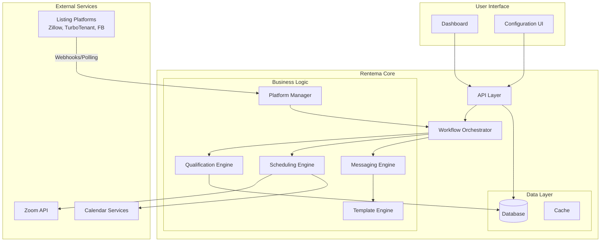

# Rentema Design Document

## Overview

Rentema is a multi-platform rental property management system that automates tenant pre-qualification, scheduling, and communications. The system integrates with external listing platforms (Zillow, TurboTenant, Facebook Marketplace) to detect inquiries, conducts automated conversational pre-qualification, evaluates tenant responses against customizable criteria, and schedules video calls and property tours with qualified candidates.

The architecture follows a modular design with clear separation between platform integrations, business logic, data persistence, scheduling services, and the user interface. This enables independent testing, platform extensibility, and maintainability.

## Architecture

### High-Level Architecture



### Technology Stack

- **Backend**: Node.js with TypeScript for type safety and maintainability
- **Database**: PostgreSQL for relational data with JSONB support for flexible schema
- **Cache**: Redis for session management and rate limiting
- **API**: RESTful API with Express.js
- **Frontend**: React with TypeScript for the dashboard and configuration UI
- **Message Queue**: Bull (Redis-based) for background job processing
- **Testing**: Jest for unit tests, fast-check for property-based testing
- **External Integrations**: 
  - Zoom SDK for video call scheduling
  - Platform-specific APIs/webhooks for inquiry detection
  - Calendar integration (Google Calendar, Outlook)

## Components and Interfaces

### 1. Platform Manager

Handles integration with external listing platforms.

**Responsibilities:**
- Authenticate and maintain connections to listing platforms
- Poll or receive webhooks for new inquiries
- Send messages through platform-specific APIs
- Normalize platform-specific data into internal format

**Interface:**
```typescript
interface PlatformManager {
  connectPlatform(credentials: PlatformCredentials): Promise<ConnectionResult>;
  verifyConnection(platformId: string): Promise<boolean>;
  pollInquiries(platformId: string): Promise<Inquiry[]>;
  sendMessage(platformId: string, recipientId: string, message: string): Promise<void>;
  disconnectPlatform(platformId: string): Promise<void>;
}

interface PlatformCredentials {
  platformType: 'zillow' | 'turbotenant' | 'facebook' | 'test';
  apiKey?: string;
  accessToken?: string;
  refreshToken?: string;
}

interface Inquiry {
  externalId: string;
  platformId: string;
  propertyId: string;
  prospectiveTenantId: string;
  message: string;
  timestamp: Date;
}
```

### 2. Qualification Engine

Evaluates tenant responses against property-specific criteria.

**Responsibilities:**
- Store and retrieve pre-qualification questions
- Evaluate responses against qualification rules
- Determine qualification status

**Interface:**
```typescript
interface QualificationEngine {
  saveQuestions(propertyId: string, questions: Question[]): Promise<void>;
  getQuestions(propertyId: string): Promise<Question[]>;
  saveResponse(inquiryId: string, questionId: string, response: Response): Promise<void>;
  evaluateQualification(inquiryId: string): Promise<QualificationResult>;
}

interface Question {
  id: string;
  text: string;
  responseType: 'text' | 'number' | 'boolean' | 'multiple_choice';
  options?: string[];
  order: number;
}

interface QualificationCriteria {
  questionId: string;
  operator: 'equals' | 'greater_than' | 'less_than' | 'contains';
  expectedValue: any;
}

interface QualificationResult {
  qualified: boolean;
  failedCriteria?: QualificationCriteria[];
}
```

### 3. Scheduling Engine

Manages availability and creates appointments for video calls and tours.

**Responsibilities:**
- Store property manager availability
- Generate available time slots
- Create and manage appointments
- Integrate with Zoom and calendar services
- Prevent double-booking

**Interface:**
```typescript
interface SchedulingEngine {
  setAvailability(managerId: string, schedule: AvailabilitySchedule): Promise<void>;
  getAvailableSlots(managerId: string, appointmentType: AppointmentType, date: Date): Promise<TimeSlot[]>;
  scheduleAppointment(appointment: AppointmentRequest): Promise<Appointment>;
  cancelAppointment(appointmentId: string): Promise<void>;
  getUpcomingAppointments(managerId: string): Promise<Appointment[]>;
}

interface AvailabilitySchedule {
  recurringWeekly: WeeklySchedule;
  blockedDates: DateRange[];
  videoCallSchedule?: WeeklySchedule;
  tourSchedule?: WeeklySchedule;
}

interface WeeklySchedule {
  [day: string]: TimeBlock[];
}

interface TimeBlock {
  startTime: string; // HH:MM format
  endTime: string;
}

interface Appointment {
  id: string;
  inquiryId: string;
  type: 'video_call' | 'tour';
  scheduledTime: Date;
  duration: number; // minutes
  zoomLink?: string;
  propertyAddress?: string;
}
```

### 4. Messaging Engine

Handles message composition and delivery through platforms.

**Responsibilities:**
- Queue messages for delivery
- Apply rate limiting
- Track message history
- Handle delivery failures and retries

**Interface:**
```typescript
interface MessagingEngine {
  sendMessage(message: OutgoingMessage): Promise<void>;
  getConversationHistory(inquiryId: string): Promise<Message[]>;
  scheduleReminder(reminder: ReminderRequest): Promise<void>;
}

interface OutgoingMessage {
  inquiryId: string;
  platformId: string;
  recipientId: string;
  content: string;
  priority: 'high' | 'normal' | 'low';
}

interface Message {
  id: string;
  inquiryId: string;
  direction: 'inbound' | 'outbound';
  content: string;
  timestamp: Date;
  status: 'sent' | 'delivered' | 'failed';
}
```

### 5. Template Engine

Manages message templates with variable substitution.

**Responsibilities:**
- Store and retrieve templates
- Validate template syntax
- Substitute variables with actual values
- Provide default templates

**Interface:**
```typescript
interface TemplateEngine {
  saveTemplate(template: MessageTemplate): Promise<void>;
  getTemplate(templateType: TemplateType): Promise<MessageTemplate>;
  renderTemplate(templateType: TemplateType, variables: TemplateVariables): Promise<string>;
  resetToDefault(templateType: TemplateType): Promise<void>;
}

interface MessageTemplate {
  type: TemplateType;
  content: string;
  requiredVariables: string[];
}

type TemplateType = 
  | 'pre_qualification_start'
  | 'pre_qualification_question'
  | 'qualification_success'
  | 'qualification_failure'
  | 'video_call_offer'
  | 'video_call_confirmation'
  | 'tour_confirmation'
  | 'reminder_24h'
  | 'reminder_2h';

interface TemplateVariables {
  tenantName?: string;
  propertyAddress?: string;
  rentAmount?: number;
  timeSlots?: string[];
  appointmentTime?: string;
  zoomLink?: string;
  [key: string]: any;
}
```

### 6. Workflow Orchestrator

Coordinates the automated workflow from inquiry to scheduling.

**Responsibilities:**
- Detect new inquiries
- Manage conversation state
- Trigger next steps in workflow
- Handle timeouts and reminders
- Coordinate between engines

**Interface:**
```typescript
interface WorkflowOrchestrator {
  processNewInquiry(inquiry: Inquiry): Promise<void>;
  processResponse(inquiryId: string, response: string): Promise<void>;
  handleTimeout(inquiryId: string): Promise<void>;
  manualOverride(inquiryId: string, action: OverrideAction): Promise<void>;
}

interface OverrideAction {
  type: 'qualify' | 'disqualify' | 'cancel_appointment' | 'add_note';
  data?: any;
}
```

## Data Models

### Property

```typescript
interface Property {
  id: string;
  managerId: string;
  address: string;
  rentAmount: number;
  bedrooms: number;
  bathrooms: number;
  availabilityDate: Date;
  isTestMode: boolean;
  isArchived: boolean;
  createdAt: Date;
  updatedAt: Date;
}
```

### Inquiry

```typescript
interface Inquiry {
  id: string;
  propertyId: string;
  platformId: string;
  externalInquiryId: string;
  prospectiveTenantId: string;
  prospectiveTenantName?: string;
  status: InquiryStatus;
  qualificationResult?: QualificationResult;
  createdAt: Date;
  updatedAt: Date;
}

type InquiryStatus = 
  | 'new'
  | 'pre_qualifying'
  | 'qualified'
  | 'disqualified'
  | 'video_call_scheduled'
  | 'tour_scheduled'
  | 'completed';
```

### Response

```typescript
interface Response {
  id: string;
  inquiryId: string;
  questionId: string;
  value: any;
  timestamp: Date;
}
```

### Platform Connection

```typescript
interface PlatformConnection {
  id: string;
  managerId: string;
  platformType: string;
  credentials: Record<string, any>; // encrypted
  isActive: boolean;
  lastVerified: Date;
  createdAt: Date;
}
```

## Correctness Properties

*A property is a characteristic or behavior that should hold true across all valid executions of a system-essentially, a formal statement about what the system should do. Properties serve as the bridge between human-readable specifications and machine-verifiable correctness guarantees.*


### Property 1: Platform credentials round-trip
*For any* valid platform credentials, storing them and then retrieving them should return equivalent credential data
**Validates: Requirements 1.1**

### Property 2: Platform configuration isolation
*For any* set of multiple platform connections, each platform's configuration should remain independent and not interfere with other platforms' configurations
**Validates: Requirements 1.3**

### Property 3: Property data persistence
*For any* valid property with details (address, rent, bedrooms, bathrooms, availability date), creating it and then retrieving it should return all fields with matching values
**Validates: Requirements 2.1**

### Property 4: Property ID uniqueness
*For any* set of created properties, all assigned property IDs should be unique
**Validates: Requirements 2.2**

### Property 5: Property update persistence
*For any* existing property, updating its details and then retrieving it should reflect all the updated values
**Validates: Requirements 2.3**

### Property 6: Property archival preservation
*For any* property with associated inquiries, deleting the property should mark it as archived and preserve all inquiry history
**Validates: Requirements 2.4**

### Property 7: Pre-qualification question round-trip
*For any* set of valid pre-qualification questions with response types, storing them and retrieving them should return all questions with matching fields
**Validates: Requirements 3.1**

### Property 8: Question-property association
*For any* property with associated questions, retrieving questions for that property should return only the questions associated with it and not questions from other properties
**Validates: Requirements 3.2**

### Property 9: Question versioning isolation
*For any* property with existing inquiries, editing the pre-qualification questions should apply changes only to new inquiries while existing inquiries retain their original questions
**Validates: Requirements 3.3**

### Property 10: Inquiry workflow initiation
*For any* new inquiry detected from a platform, the system should send the first pre-qualification question to the prospective tenant
**Validates: Requirements 4.2**

### Property 11: Response storage completeness
*For any* inquiry where all pre-qualification questions are answered, the system should store all responses with timestamps
**Validates: Requirements 4.4**

### Property 12: Qualification criteria persistence
*For any* valid set of qualification criteria, storing them and retrieving them should return matching criteria rules
**Validates: Requirements 5.1**

### Property 13: Qualification evaluation correctness
*For any* inquiry with complete responses and defined qualification criteria, evaluating the inquiry should mark it as qualified if all criteria are met, or disqualified if any criterion fails
**Validates: Requirements 5.2, 5.3, 5.4**

### Property 14: Qualified inquiry scheduling trigger
*For any* inquiry marked as qualified, the system should send a message offering available video call time slots
**Validates: Requirements 6.1**

### Property 15: Appointment data persistence
*For any* scheduled video call or tour with details (date, time, type, property), storing it and retrieving it should return all fields with matching values
**Validates: Requirements 6.3**

### Property 16: Double-booking prevention
*For any* time slot that already has a scheduled appointment, attempting to schedule another appointment at an overlapping time should be prevented
**Validates: Requirements 6.5**

### Property 17: Available slot generation respects availability
*For any* property manager availability schedule, all generated available time slots should fall within the defined availability periods and exclude blocked dates
**Validates: Requirements 7.2, 11.3**

### Property 18: Tour confirmation message completeness
*For any* scheduled tour, the confirmation message should contain the property address and appointment details
**Validates: Requirements 7.3**

### Property 19: Inquiry grouping by property
*For any* set of inquiries associated with different properties, grouping them by property should place each inquiry only in its associated property's group
**Validates: Requirements 8.1**

### Property 20: Inquiry history completeness
*For any* inquiry with conversation messages and responses, retrieving the inquiry should return the complete conversation history and all collected responses
**Validates: Requirements 8.3**

### Property 21: Inquiry filtering correctness
*For any* set of inquiries and filter criteria (property, status, date range), the filtered results should include only inquiries that match all specified criteria
**Validates: Requirements 8.4**

### Property 22: Manual qualification workflow continuation
*For any* disqualified inquiry that is manually marked as qualified, the system should proceed with the automated scheduling workflow
**Validates: Requirements 9.2**

### Property 23: Appointment cancellation notification
*For any* scheduled appointment that is cancelled, the system should send a cancellation notification to the prospective tenant
**Validates: Requirements 9.3**

### Property 24: Inquiry notes persistence
*For any* inquiry with added notes, retrieving the inquiry should return all notes with their timestamps
**Validates: Requirements 9.4**

### Property 25: Template variable substitution
*For any* message template with variables and provided variable values, rendering the template should replace all template variables with their corresponding actual values
**Validates: Requirements 10.1, 10.3**

### Property 26: Template validation
*For any* message template missing required variables, attempting to save it should be rejected by validation
**Validates: Requirements 10.2**

### Property 27: Template reset to default
*For any* modified message template, resetting it should restore the original default template content
**Validates: Requirements 10.5**

### Property 28: Availability schedule persistence
*For any* valid availability schedule with recurring weekly time blocks, storing it and retrieving it should return matching schedule data
**Validates: Requirements 11.1**

### Property 29: Blocked period exclusion
*For any* availability schedule with blocked dates or times, generated available slots should exclude all blocked periods
**Validates: Requirements 11.2**

### Property 30: Availability update immediacy
*For any* updated availability schedule, subsequent slot generation requests should use the updated schedule
**Validates: Requirements 11.4**

### Property 31: Separate availability schedules
*For any* property manager with different availability schedules for video calls and tours, generating slots for each appointment type should use its respective schedule
**Validates: Requirements 11.5**

### Property 32: Test mode workflow execution
*For any* simulated inquiry in test mode, the system should execute the complete automated workflow without requiring actual platform connections
**Validates: Requirements 12.3**

## Error Handling

### Platform Integration Errors

- **Connection Failures**: When a platform connection fails, the system should log the error, mark the connection as inactive, and notify the property manager with specific error details
- **API Rate Limiting**: Implement exponential backoff and retry logic for rate-limited requests
- **Webhook Failures**: Store failed webhook payloads for manual review and retry
- **Message Delivery Failures**: Queue failed messages for retry with exponential backoff, up to 3 attempts

### Data Validation Errors

- **Invalid Property Data**: Validate all required fields before persisting; return clear error messages for missing or invalid data
- **Invalid Question Configuration**: Validate question types and options; prevent saving invalid configurations
- **Invalid Qualification Criteria**: Validate criteria operators and expected values match question types
- **Invalid Template Syntax**: Validate template variables exist and are properly formatted before saving

### Scheduling Errors

- **Double-Booking Attempts**: Detect conflicts before creating appointments; return available alternative slots
- **Invalid Time Slots**: Validate requested times fall within availability; reject invalid requests
- **Zoom API Failures**: Implement fallback to manual scheduling if Zoom integration fails
- **Calendar Sync Failures**: Log failures and allow manual calendar entry as fallback

### Workflow Errors

- **Incomplete Responses**: Handle cases where tenants abandon pre-qualification mid-way
- **Timeout Handling**: Implement configurable timeouts for each workflow stage
- **State Inconsistencies**: Use database transactions to maintain consistency across related updates
- **Concurrent Modifications**: Implement optimistic locking to prevent race conditions

## Testing Strategy

### Unit Testing

Rentema will use Jest as the primary unit testing framework. Unit tests will focus on:

- **Individual component logic**: Test each engine (Qualification, Scheduling, Messaging, Template) in isolation
- **Data validation functions**: Verify input validation catches invalid data
- **Business rule enforcement**: Test qualification criteria evaluation, availability checking, conflict detection
- **Error handling paths**: Verify proper error handling for edge cases
- **Template rendering**: Test variable substitution with various inputs

Unit tests should mock external dependencies (database, external APIs) to test logic in isolation.

### Property-Based Testing

Rentema will use **fast-check** as the property-based testing library for TypeScript/Node.js. Property-based tests will verify universal properties across randomly generated inputs.

**Configuration**: Each property-based test should run a minimum of 100 iterations to ensure thorough coverage of the input space.

**Tagging**: Each property-based test MUST include a comment tag explicitly referencing the correctness property from this design document using the format: `**Feature: rental-automation, Property {number}: {property_text}**`

**Property Test Coverage**:
- Round-trip properties for data persistence (Properties 1, 3, 7, 12, 15, 24, 28)
- Invariant properties for data integrity (Properties 2, 4, 6, 8, 9, 19, 31)
- Behavioral properties for workflow logic (Properties 10, 13, 14, 22, 32)
- Constraint properties for scheduling (Properties 16, 17, 29, 30)
- Transformation properties for templates (Properties 25, 26, 27)
- Filtering and grouping properties (Properties 19, 21)

Property-based tests should generate realistic random data that respects domain constraints (e.g., valid dates, positive numbers for rent, valid time formats).

### Integration Testing

Integration tests will verify:
- End-to-end workflow from inquiry detection to scheduling
- Database operations with real database connections (test database)
- Message queue processing with Redis
- API endpoint behavior

### Test Mode

The system includes a test mode (Requirement 12) that allows testing without external platform connections. This mode should:
- Use in-memory or mock platform adapters
- Generate simulated inquiries
- Execute full workflows without external API calls
- Provide clear indicators that the system is in test mode

## Implementation Notes

### Security Considerations

- **Credential Storage**: Platform credentials must be encrypted at rest using AES-256
- **API Authentication**: Use JWT tokens for API authentication with short expiration times
- **Rate Limiting**: Implement rate limiting on all API endpoints to prevent abuse
- **Input Sanitization**: Sanitize all user inputs to prevent injection attacks
- **HTTPS Only**: All external communications must use HTTPS

### Scalability Considerations

- **Message Queue**: Use Bull with Redis for background job processing to handle high inquiry volumes
- **Database Indexing**: Index frequently queried fields (propertyId, inquiryId, status, timestamps)
- **Caching**: Cache frequently accessed data (templates, availability schedules) in Redis
- **Horizontal Scaling**: Design stateless API servers that can be horizontally scaled

### Extensibility

- **Platform Adapters**: Use adapter pattern for platform integrations to easily add new platforms
- **Plugin Architecture**: Design template engine and qualification engine to support custom plugins
- **Webhook Support**: Provide webhook endpoints for external systems to integrate with Rentema
- **API Versioning**: Version the API to support backward compatibility as features evolve

### Monitoring and Observability

- **Logging**: Implement structured logging with correlation IDs for request tracing
- **Metrics**: Track key metrics (inquiry volume, qualification rates, scheduling success rates)
- **Alerting**: Set up alerts for critical failures (platform connection failures, message delivery failures)
- **Audit Trail**: Maintain audit logs for all property manager actions and system decisions
